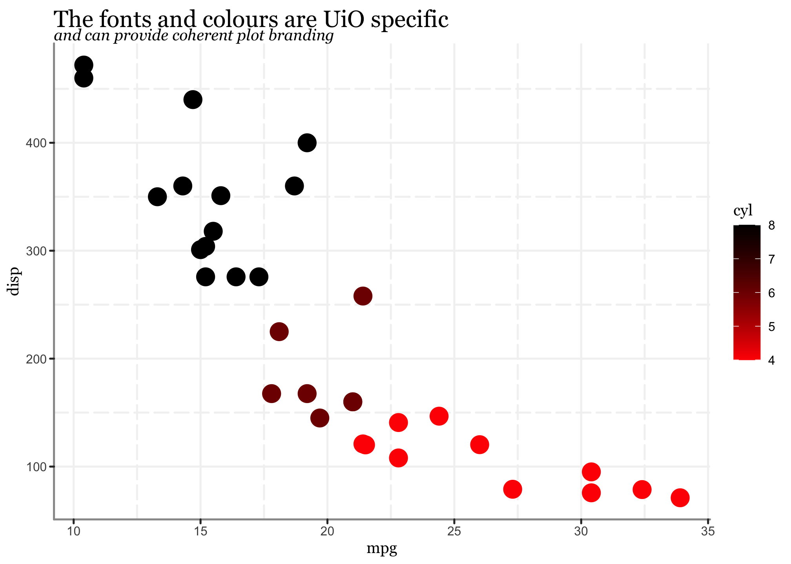

<!-- README.md is generated from README.Rmd. Please edit that file -->

# uiothemes

<!-- badges: start -->

[](https://CRAN.R-project.org/package=uiothemes)
[](https://github.com/Athanasiamo/uiothemes/actions)
[](https://travis-ci.com/Athanasiamo/uiothemes)
<!-- badges: end -->

The goal of uiothemes is to provide branded templates for the University
of Oslo for commonly used R markdown packages. Currently the package
contains: - Presentation template for the
[xaringan](https://slides.yihui.org/xaringan/#1)-package  
\- Tutorial template for the
[learnr](https://rstudio.github.io/learnr/)-package - Website template
for the
[Distill](https://rstudio.github.io/distill/website.html)-package  
\- Article template for the
[Distill](https://rstudio.github.io/distill/basics.html)-package  
\- Themes for the [ggplot2](https://ggplot2.tidyverse.org/)-package  
\- Colour and fill scales for the
[ggplot2](https://ggplot2.tidyverse.org/)-package

## Installation

You can install uiothemes from github

``` r
# install.packages("remotes")
remotes::install_github("Athanasiamo/uiothemes")
```

<!-- You can install the released version of uiothemes from [CRAN](https://CRAN.R-project.org) with: -->

<!-- ``` r -->

<!-- install.packages("uiothemes") -->

<!-- ``` -->

## Basic use

xaringan presentation, learnr tutorial and distill article tempaltes
with UiO branding can be access easily using the RStudio IDE, by
selecing `File` -\> `R markdown ...` -\> `From Template`.


Distill website template can be access most easily through the RStudio
IDE to create a new project. `File` -\> `New project...` -\> `New
Directory` -\> `UiO Distill Website`


### ggplot2 branding

The ggplot branding is applied through themes and scales.

``` r
library(uiothemes)
library(ggplot2)

ggplot(mtcars, aes(mpg, disp, colour = cyl)) +
  geom_point(size = 5) +
  scale_colour_uio(discrete = FALSE) +
  theme_uio() +
  labs(title = "The fonts and colours are UiO specific",
       subtitle = "and can provide coherent plot branding")
```



``` r

ggplot(mtcars, aes(mpg, disp, colour = cyl)) +
  geom_point(size = 5) +
  scale_colour_uio(palette = "redwhite", discrete = FALSE) +
  theme_uio_dark() +
  labs(title = "The fonts and colours are UiO specific",
       subtitle = "and can provide coherent plot branding")
```


